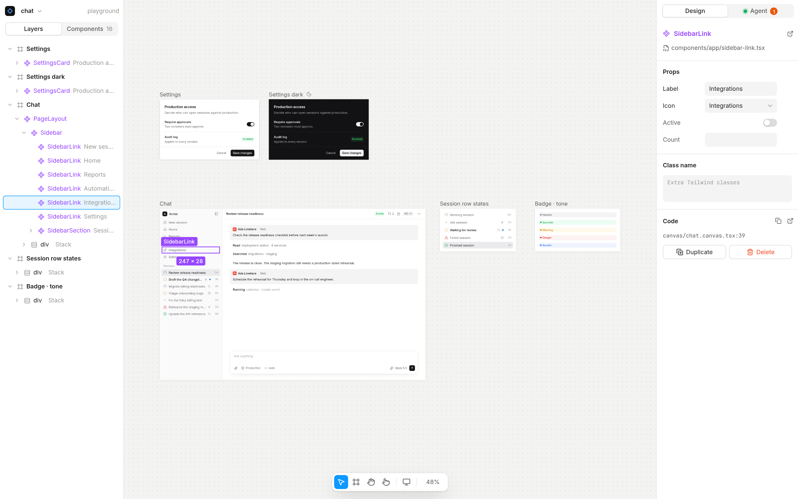

# Truecanvas

**A Figma-like canvas for your real React components. The code is the document.**

[](https://www.npmjs.com/package/truecanvas)
[](https://github.com/Nathandona/truecanvas/actions/workflows/ci.yml)
[](LICENSE)

Truecanvas renders your actual `.tsx` components on an infinite canvas and writes every change back to plain TSX in your repo. It has no built-in AI: it is agent-first through **MCP**, so Claude Code, Cursor, Codex or any MCP client can read your design system, edit frames and take screenshots while you watch and steer.

[truecanvas.dev](https://truecanvas.dev)



## Features

- **Real components.** Layers are instances of your components, with a props panel generated from their TypeScript types.
- **Code is the document.** A canvas is a `.canvas.tsx` file. Edits are minimal patches that keep your formatting, so diffs stay reviewable.
- **Agent-first.** 49 MCP tools to read the tree, insert JSX, set props and classes, create frames and variants, take screenshots and make images for social posts.
- **Design on real pages.** Link any Next.js page as a frame: editing its layers edits `page.tsx` and its layouts.
- **Components and libraries.** Turn a selection into a component, edit main components, install icon sets (Lucide, Tabler, Phosphor, Heroicons, Radix) and add shadcn/ui components.
- **Share with clients.** One click freezes a page into a private link on your own domain: clients look and comment in their browser, nothing to install, and their comments land on your canvas for you or your agent to answer.
- **Shots for X and LinkedIn.** Stage a frame on a Paper shader or a gradient, with a browser or phone frame, a tilt and a soft shadow, at a social format, and export a sharp PNG, or an MP4 of the page itself rising in, scrolling or drifting with its own animations. Settings are saved, so shots can be made again after the design changes.
- **Git built in.** Per-frame change summaries, branches, commits, pull requests with before/after images, visual compare and comments that travel with branches.
- **Motion, devices, themes.** Scroll reveals and text animations, iPhone/Pixel/iPad presets with device chrome, and per-frame light and dark themes.
- **Lightweight.** Frames render through your existing dev server. Headless Chromium only starts when an agent asks for a screenshot.

## Quick start

In a **Next.js** (App Router, 15.3+) or **Vite + React** (5+) app:

```bash
npx truecanvas
```

The first run sets the project up: the dev dependency, the plugin in `next.config` or `vite.config`, a `canvas` script and a first canvas. It then starts your app and opens the editor. After that, use `npm run canvas`.

Start a new app instead:

```bash
npm create truecanvas@latest my-app            # asks Next.js or Vite
npm create truecanvas@latest my-app -- --vite
```

Run `npx truecanvas doctor` if anything looks off: it checks every requirement and prints a fix for each problem.

## Connect your agent

```bash
npx truecanvas connect
```

This adds Truecanvas to the project's `.mcp.json`. Commit it and every teammate's agent is connected.

| Client | Config |
| --- | --- |
| Claude Code | `.mcp.json`, or `claude mcp add --scope user --transport http truecanvas http://localhost:4800/mcp` |
| Cursor | `.cursor/mcp.json`: `{ "mcpServers": { "truecanvas": { "url": "http://localhost:4800/mcp" } } }` |
| VS Code | `.vscode/mcp.json`: `{ "servers": { "truecanvas": { "type": "http", "url": "http://localhost:4800/mcp" } } }` |
| Codex | `~/.codex/config.toml`: `[mcp_servers.truecanvas]` with `url = "http://localhost:4800/mcp"` |
| stdio clients | `{ "command": "npx", "args": ["truecanvas", "mcp"] }` |

Then select something and ask: *"Make my selection denser"* or *"Show every status of SessionRow in a variants frame"*.

## A canvas file

```tsx
"use client";
import { Canvas, Frame } from "truecanvas";
import { SessionRow } from "@/components/session-row";

export default function ChatCanvas() {
  return (
    <Canvas>
      <Frame name="Sessions" x={0} y={0} width={320}>
        <SessionRow title="Review release readiness" status="working" />
      </Frame>
      <Frame name="Sessions dark" x={360} y={0} width={320} theme="dark">
        <SessionRow title="Draft the changelog" status="review" />
      </Frame>
    </Canvas>
  );
}
```

`<Frame>` takes `name`, `x`, `y`, `width`, and optionally `height`, `theme`, `device`, `page` (a linked page) or `component` (a main component). Each frame renders in its own iframe at its own width, so media queries, portals and `position: fixed` behave as in your app. Literal props are editable in the inspector; expressions still render but are read-only.

## How it works

1. A dev-only plugin (Turbopack/webpack loader for Next.js, Vite plugin for Vite) stamps each JSX element with its source position. Production builds are untouched.
2. Each frame loads `/truecanvas/<canvas>` from your dev server, where a small runtime maps what's under the pointer back to that position.
3. Your gestures and your agent's MCP calls become the same commands. The server patches the source and your dev server hot-reloads the frame.

## MCP tools

| | Tools |
| --- | --- |
| Read | `list_canvases` `get_canvas` `get_node` `get_selection` `list_components` `get_component` `get_design_tokens` `list_comments` |
| Edit | `insert_jsx` `replace_node` `set_props` `set_text` `set_class_name` `move_node` `duplicate_nodes` `delete_nodes` `wrap_nodes` `undo` `redo` |
| Frames and pages | `create_frame` `update_frame` `create_variants_frame` `create_canvas` `rename_canvas` `delete_canvas` `import_page` `explore_copy` `apply_to_page` |
| Components and libraries | `create_component` `open_component` `list_libraries` `install_library` `search_icons` `insert_icon` `add_shadcn_components` |
| Look and show | `share_canvas` `make_shot` `list_shots` `screenshot_frame` `focus` `play_frame` `add_animation` `remove_animation` `add_background` `apply_preset` `reply_comment` `resolve_comment` |

Node ids are the JSX tag's `line:col` and change after edits; every write returns the fresh ids. Catalog components are imported automatically.

## Collaborate

Canvases, comments and linked pages are files in your repo, so design changes are branched, reviewed and merged like code. From the Git panel you can branch, commit with a per-frame summary, open a pull request with before/after images, and compare against any branch or commit. Comments are saved with the canvas and agents can read and resolve them.

The **Truecanvas window** (`npx truecanvas open`) manages several projects in tabs, clones from GitHub and reviews pull requests on the canvas.

The **desktop app** (Linux AppImage and deb, from the [releases](https://github.com/Nathandona/truecanvas/releases)) is the same window, installed: it runs in the tray, starts each project's dev server with your own Node when you open it and stops it after 30 minutes unused, notifies you when a client comments on a share link, can start at login, and updates itself.

## Share with clients

**Share** (top right in the editor), `npx truecanvas share <canvas>`, or your agent's `share_canvas` renders every frame through your app and freezes it into static HTML and CSS: no scripts, so a link can never call your API or leak a session. It's published to your own review site as a new version of that page's link. Clients open it in any browser, with an optional password, and pin comments on the frames. Their threads sync into the canvas's comments while Truecanvas runs; your replies and your agent's (`reply_comment`, `resolve_comment`) go back to the link, under your studio's name. Comments you start in Truecanvas stay internal. `--revoke` takes a link down and `--delete` removes it with its comments.

On a review site that hosts live sites (the Cloudflare one), each share also includes **the real site**: Truecanvas builds your app as static pages (a copy, so your dev server keeps running), and page frames show the actual page, scrollable and clickable, animations included. Clients click a page to interact with it, and **Full screen** opens it at a real screen size. Sharing again only uploads the files that changed. Pages that need a server (API routes, middleware) can't be built this way: the share then keeps frozen frames and says why. `--frozen` leaves the real site out; `--live <dir|url>` uses another build folder or the URL where the app runs.

On the Cloudflare review site, **Live session** in the Share dialog, `npx truecanvas share <canvas> --session` or your agent's `start_session` opens a **live session**: everyone with access to the link sees the canvas live from your app, updating as you edit, with each other's cursors and comments arriving as they're written. Stop it and the link shows the latest published version again.

On the Cloudflare review site with sign-in, `--invite client@company.com` emails your client an invitation: they sign in with a link, no password, and comment under their name. New links are for invited people and your studio; `--access password|public` changes that, and `--link-only` invites or changes access without a new version.

You deploy the review site once, on your own domain:

- **Cloudflare** (`packages/review-worker`, recommended): Workers, D1 and R2 on the free plan, hosts live sites. See its [README](packages/review-worker/README.md).
- **Vercel** (`packages/review`): create a project with **Root Directory** `packages/review`, add a private **Blob** store and **Upstash for Redis**, set `REVIEW_TOKEN` (a long random string) and optionally `BRAND_NAME` and `BRAND_LOGO`, then add your domain. Frozen frames and comments only.

Then connect Truecanvas: `npx truecanvas share setup https://review.your-studio.com`.

Without a review site, Share still makes a local preview of what clients would see.

## Shots for social posts

Select a frame, then **Make a shot** in its panel. The frame, as your app renders it, is staged on a backdrop for posting:

- **Backdrop**: a Paper shader (Mesh, Grain, Silk, Glow, Warp), a gradient or a color, with film grain. Palettes come from your design (colors sampled from the frame), your Tailwind theme, or a few hand-picked ones; Shuffle tries another variation.
- **Framing**: margin, corners, shadow, 3D tilt, a browser or phone frame, centered or rising from the bottom edge.
- **Crop**: the top of the frame (most posts) or all of it. **Formats**: 4:5 (LinkedIn and X feed), 1:1, 16:9, 9:16, 3:2, exported at 2x.

**Copy image** puts it on the clipboard to paste into a post; **Export PNG** downloads it. Shots are saved in `canvas/<page>.shots.json`, so they're versioned with the repo and can be exported again after design changes:

```bash
npx truecanvas shot home                         # the home page's latest shot, to shots/
npx truecanvas shot home --frame Pricing --format 1:1
npx truecanvas shot home --all                   # every saved shot again
```

**Video**: switch the dialog to Video and the frame is your page itself, live: **Reveal** (it rises into place while its own animations play), **Scroll** (it scrolls like a visitor would, scroll animations included: it eases in, cruises at one speed and eases out, and its distance, speed and length stay linked) or **Drift** (a slow push in), 3 to 15 seconds, with the shader backdrop moving gently. The preview plays in the dialog; **Export video** records it frame by frame on a virtual clock, so every frame is exact however busy the machine is, and encodes a 60 fps MP4 at the format's size (30 fps renders twice as fast; about 10 to 20 seconds of rendering per second of video). It needs `ffmpeg` (`npx truecanvas doctor` checks); without one with H.264, Playwright's ffmpeg writes WebM.

```bash
npx truecanvas shot home --frame Home --video --motion scroll --duration 8
```

Agents use `make_shot` ("make a LinkedIn image of the hero on a navy gradient", or with `video` for an MP4): it saves the shot, exports it to `shots/` and looks at a preview (a frame of the video) to adjust.

## Configuration

Everything is optional. Add a `truecanvas.config.json` at the project root:

```json
{
  "appUrl": "http://localhost:3000",
  "port": 4800,
  "canvasDir": "canvas",
  "components": ["components/**/*.tsx"],
  "darkMode": { "strategy": "class", "value": "dark" },
  "css": ["/src/index.css"],
  "editor": "code"
}
```

`darkMode` describes how your app switches themes (a class, or `{ "strategy": "attribute", "attribute": "data-theme", "value": "dark" }`). `css` (Vite only) lists the stylesheets frames load; by default, the ones your entry module imports.

## Requirements

- Node 22+ (24 LTS recommended) and React 19
- Next.js 15.3+ (App Router) or Vite 5+. Tailwind is optional; the style controls write Tailwind classes.
- macOS, Linux or Windows
- Screenshots: Chrome, Edge or Chromium, or `npx playwright install chromium-headless-shell`
- Pull requests: the GitHub CLI (`gh auth login`)

Linked page frames need Next.js file-based routes. Everything else works the same in Vite apps.

## Development

```bash
pnpm install
pnpm build                            # library and editor
pnpm --filter truecanvas test         # tests
pnpm dev                              # playground app and editor
pnpm --filter truecanvas dev:editor   # editor with HMR on :4801
```

Releases: `pnpm release <version>` bumps both packages and tags; `git push --follow-tags` publishes to npm from GitHub Actions with provenance.

## License

[MIT](LICENSE)
